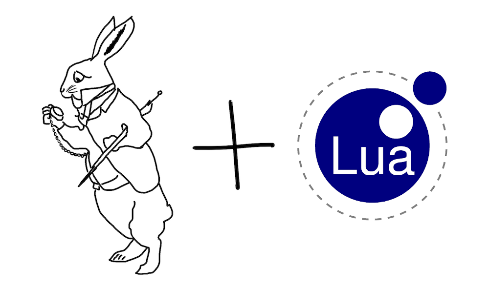

[](https://github.com/ligurio/afl-lua/actions/workflows/check.yaml)
[](https://github.com/ligurio/afl-lua/actions/workflows/test.yaml)
[](https://opensource.org/licenses/ISC)
[](https://luarocks.org/modules/ligurio/afl-lua)

# afl-lua



is a project that brings integration of [AFL++][aflplus-url] (American Fuzzy
Lop) with Lua programming language. It allows to perform fuzzing testing of
programs written in Lua.

## Installation

- Download and setup Lua interpreter and LuaRocks.
- Install AFL++ package: `sudo apt install -y afl++` (on Debian).
- Install module using LuaRocks: `luarocks --local install afl-lua`.
- Update a `PATH`: `export PATH=$PATH:$(luarocks path --lr-bin)`.

## Usage

Create a file with Lua program that reads a string from a STDIN:

```sh
$ cat << EOF > example.lua
function fuzz()
    local buf = io.read("*a")
    local b = {}
    buf:gsub(".", function(c) table.insert(b, c) end)
    if b[1] == 'l' then
        if b[2] == 'u' then
            if b[3] == 'a' then
                assert(nil)
            end
        end
    end
end

fuzz()
EOF
```

Make sure Lua script has failed when string "lua" is passed to STDIN:

```sh
$ echo "lua" | lua example.lua
lua: example.lua:8: assertion failed!
stack traceback:
        [C]: in function 'assert'
        example.lua:8: in function 'fuzz'
        example.lua:14: in main chunk
        [C]: in ?
```

Execute `afl-lua` against a Lua script:

```sh
$ mkdir -p {in,out}
$ echo -n "\0" > in/corpus
$ __AFL_SHM_ID=$RANDOM afl-fuzz -D -i in/ -o out/ afl-lua example.lua
```

After some time, the fuzzer will find a test case with which the program will crash:

```sh
$ cat out/default/crashes/id\:000000\,sig\:06\,src\:000008\,time\:197253\,execs\:113636\,op\:havoc\,rep\:4
luaiiiii^ii
```

## License

- Copyright © 2022-2023 [Sergey Bronnikov](https://bronevichok.ru/)
- Copyright © 2020 Steven Johnstone

Distributed under the ISC License.

[aflplus-url]: https://aflplus.plus/
[aflplus-mutators-url]: https://aflplus.plus/docs/custom_mutators/
